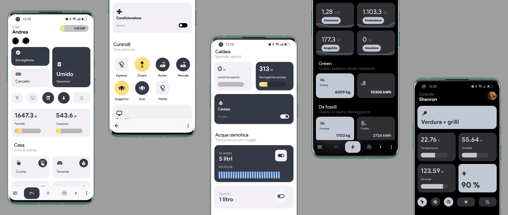
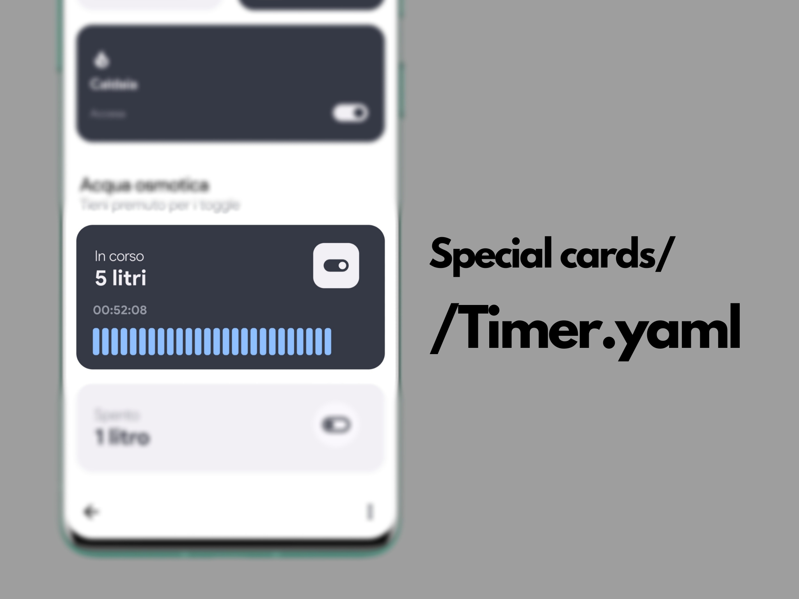
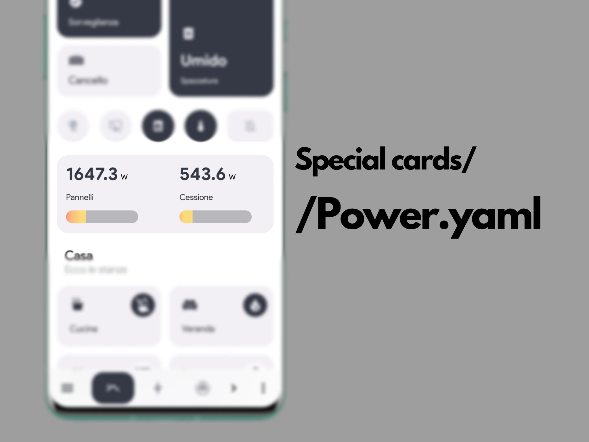
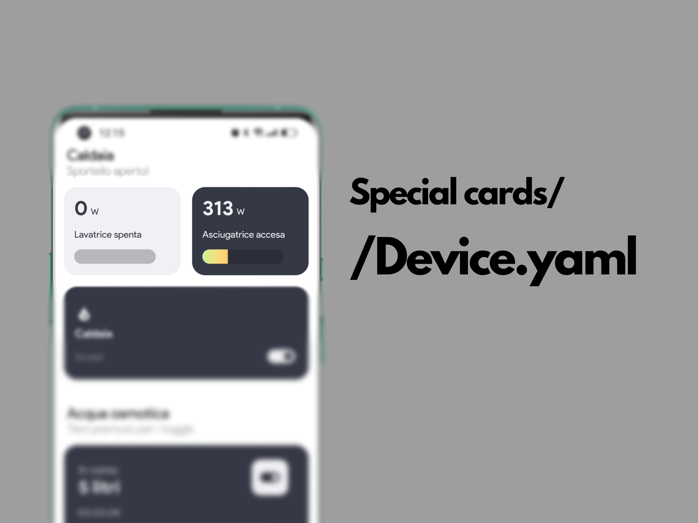
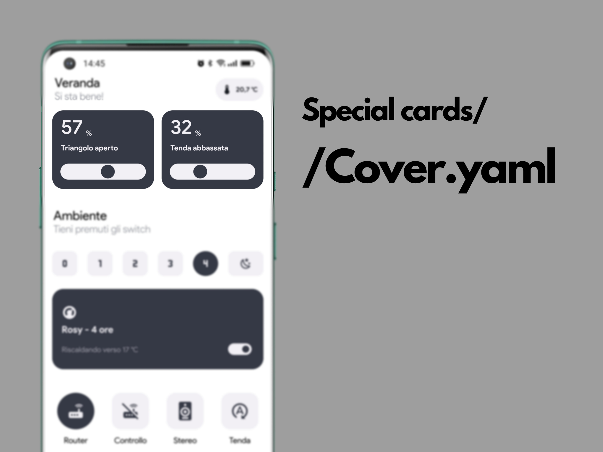
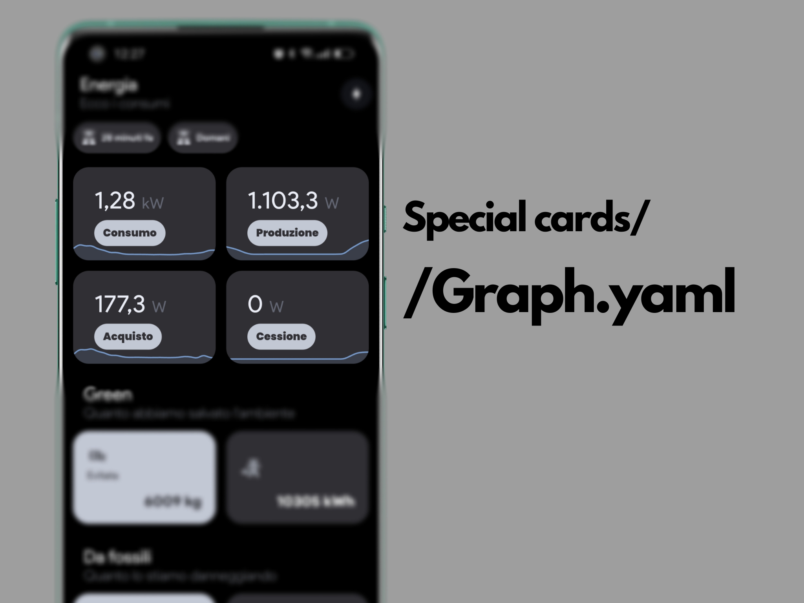
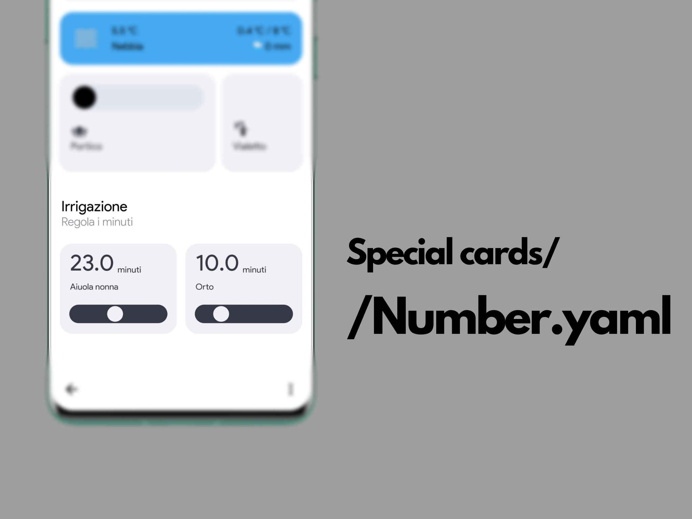
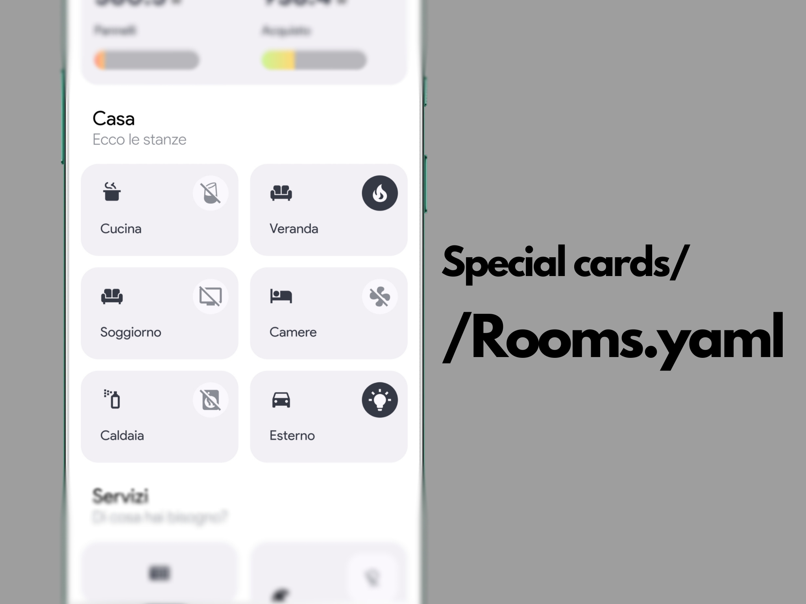

# Minimal UI
Here is the new minimal dashboard for your home assistant!
#### Posted in the [forum](https://community.home-assistant.io/t/rounded-dashboard-guide/543043/391?u=arroma)

###### *Also take a look at [pixel-like dashboard](https://github.com/Arroma98/Pixel-like-dashboard)*

### Dashboard

#### Timer.yaml

#### Power.yaml

#### Power_device.yaml

#### Cover.yaml

#### Graph.yaml

#### Number.yaml

#### Rooms.yaml

